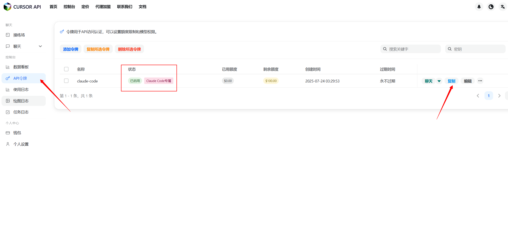

# cheapClaude CC

**中文** | [English](README_EN.md)

使用更便宜的Claude模型（claude-opus-4-20250514）驱动您的Claude Code。

[全面调研claude-opus-4-20250514性能参数](https://www.anthropic.com/claude/opus)

## 快速安装

1. 前往CursorAI开放平台申请API Key。

点击前往：[CursorAI开放平台](https://api.cursorai.art/register?aff=xoXg/)

右上角控制台 -> API令牌 -> 添加令牌 -> 往下滑动到底部 -> 在分组设置中为您的令牌设置**Claude Code专属**分组



2. 根据您的操作系统选择安装方式：

### Unix/Linux/macOS

```shell
bash -c "$(curl -fsSL https://raw.githubusercontent.com/XTurnV007/cheapClaude-cc/refs/heads/main/install.sh)"
```

### Windows

在 PowerShell 中运行（建议以管理员身份）：

```powershell
Invoke-WebRequest -Uri "https://raw.githubusercontent.com/XTurnV007/cheapClaude-cc/refs/heads/main/install.ps1" -OutFile "install.ps1" -ContentType "text/plain; charset=utf-8"; Get-Content -Path "install.ps1" -Encoding UTF8 | Out-String | Invoke-Expression; Remove-Item "install.ps1"
```

如果遇到执行策略问题，先运行：
```powershell
Set-ExecutionPolicy -ExecutionPolicy RemoteSigned -Scope CurrentUser
```

3. 开始低成本使用 Claude Code。

```shell
claude
```

## 手动安装（所有平台）

如果自动安装脚本无法使用，您可以手动安装：

1. 安装 Node.js 18+ 版本：https://nodejs.org/
2. 安装 Claude Code：
   ```
   npm install -g @anthropic-ai/claude-code
   ```
3. 设置环境变量：
   - `ANTHROPIC_BASE_URL=https://api.cursorai.art`
   - `ANTHROPIC_API_KEY=你的API密钥`
