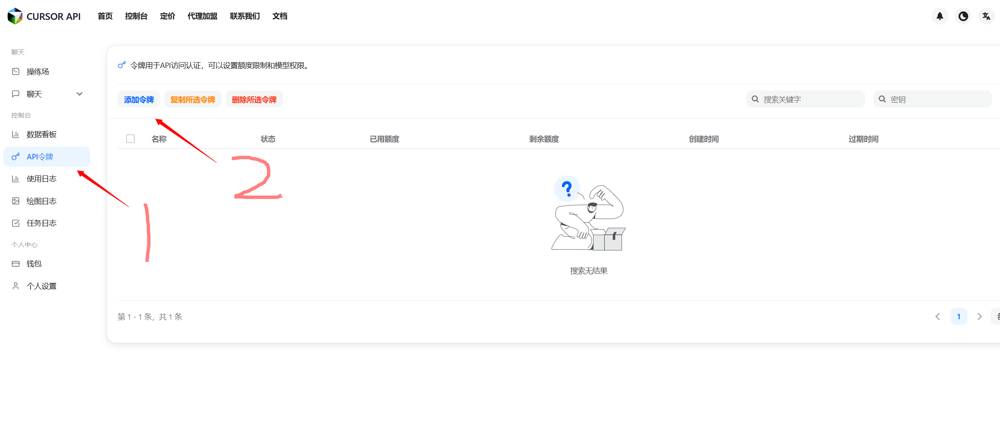
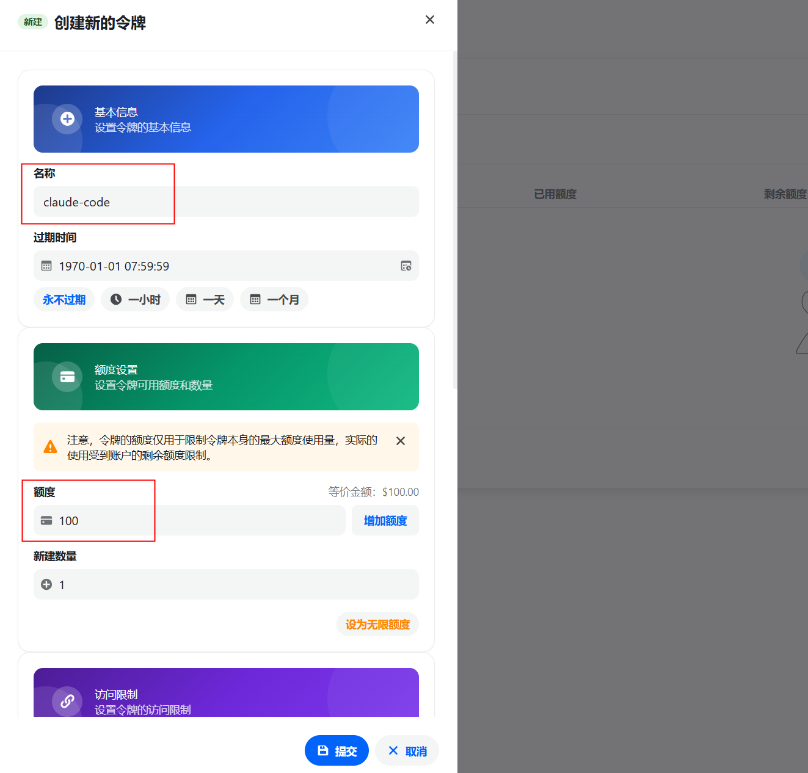
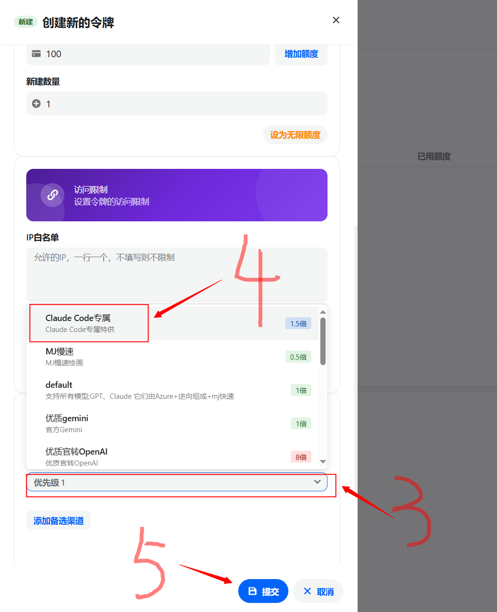
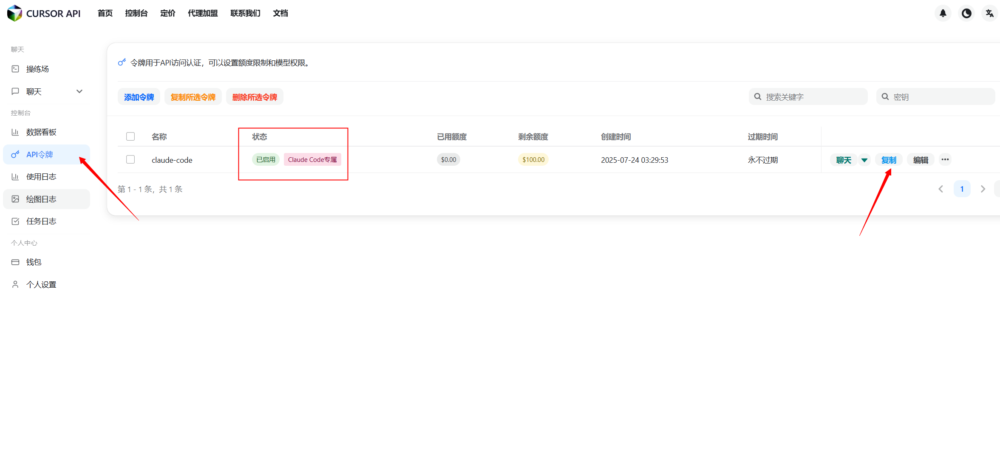

# cheapClaude CC

[中文](README.md) | **English**

Use cheaper Claude models (claude-opus-4-20250514) to power your Claude Code.

[Comprehensive research on claude-opus-4-20250514 performance parameters](https://www.anthropic.com/claude/opus)

## Quick Installation

1. Go to CursorAI Open Platform to apply for an API Key.

Click to visit: [CursorAI Open Platform](https://api.cursorai.art/register?aff=xoXg/)

Top right corner Console -> API Tokens -> Add Token -> Scroll down to the bottom -> In the grouping settings, set your token to the **Claude Code专属** group






2. Choose installation method based on your operating system:

### Unix/Linux/macOS

```shell
bash -c "$(curl -fsSL https://raw.githubusercontent.com/XTurnV007/cheapClaude-cc/refs/heads/main/install.sh)"
```

### Windows

Run in PowerShell (recommended to run as Administrator):

```powershell
Invoke-WebRequest -Uri "https://raw.githubusercontent.com/XTurnV007/cheapClaude-cc/refs/heads/main/install.ps1" -OutFile "install.ps1" -ContentType "text/plain; charset=utf-8"; Get-Content -Path "install.ps1" -Encoding UTF8 | Out-String | Invoke-Expression; Remove-Item "install.ps1"
```

If you encounter execution policy issues, first run:
```powershell
Set-ExecutionPolicy -ExecutionPolicy RemoteSigned -Scope CurrentUser
```

3. Start using Claude Code at low cost.

```shell
claude
```

## Manual Installation (All Platforms)

If the automatic installation script doesn't work, you can install manually:

1. Install Node.js 18+ version: https://nodejs.org/
2. Install Claude Code:
   ```
   npm install -g @anthropic-ai/claude-code
   ```
3. Set environment variables:
   - `ANTHROPIC_BASE_URL=https://api.cursorai.art`
   - `ANTHROPIC_API_KEY=your_api_key` 


## FAQ Summary

1. After configuration is complete, no response to questions and no error messages

Please set your token group on the CURSOR API platform to the **Claude Code专属** group.

2. Claude code shows **"offline"** after answering each question

Being offline means not logged into an account. This project's method doesn't require logging into an account.